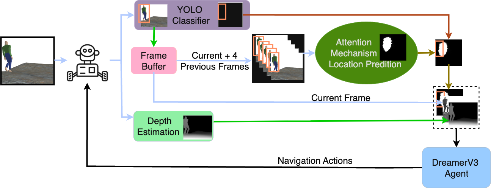

# Social Navigation in Unstructured Environments (Attention)

Hybrid social navigation for robots in unstructured, human-occupied spaces.  
This repository contains the inference pipeline and supporting tools for our paper, "Social Navigation in Unstructured Environments." The system couples (i) spatiotemporal attention for near-future human occupancy prediction with (ii) model-based RL (DreamerV3) for traversability-aware control. In short: we predict where people are about to be, infer terrain structure, and navigate accordingly.



## TL;DR

Run the ROS2 camera bridge, then run inference.

```bash
# terminal 1 (ROS2 -> shared memory)
cd inference
python ros2_mem_share.py
```

```bash
# terminal 2 (pipeline inference from repo root)
python inference.py --attention_mode ./model_output/checkpoint_epoch_1000.pkl
```

---

## Table of Contents

- [Project Highlights](#project-highlights)
- [Pipeline Overview](#pipeline-overview)
- [Quickstart](#quickstart)
- [Expected Outputs](#expected-outputs)
- [Repository Layout](#repository-layout)
- [Configuration and Models](#configuration-and-models)
- [Datasets](#datasets)
- [Troubleshooting](#troubleshooting)
- [Roadmap](#roadmap)
- [Citing This Work](#citing-this-work)
- [License](#license)
- [Contact](#contact)
- [Acknowledgments](#acknowledgments)

---

## Project Highlights

- Socially aware perception: YOLO detections + spatiotemporal attention predict where people will be next (dense heatmaps).
- Terrain awareness: Monocular depth estimation produces scene geometry; fused with human occupancy and grayscale imagery.
- RL control: A DreamerV3 agent consumes a compact 3-channel observation (attention/semantic, depth, grayscale) to plan safe, efficient PointNav trajectories through rough terrain and crowds.
- Simulation focus: Validated in simulation with dynamic human actors and large equipment.

---

## Pipeline Overview

**Inputs (per frame):**
- RGB stream from a ROS2 camera topic.
- YOLO person detections to create binary masks and temporal links.
- Monocular depth from the latest RGB image.

**Spatiotemporal attention:**
- CNN encodes short RGB+mask history.
- Multi-head attention predicts a heatmap of likely human future positions.

**Fusion for control:**
- Combine (1) heatmap, (2) depth, (3) grayscale to form a 96x96x3 observation.
- Observation sent to DreamerV3 policy for socially aware navigation.

---

## Quickstart

### 1. Environment Setup

- Python 3.10+ recommended
- GPU optional (for ONNXRuntime CUDA + JAX speedup)

```bash
pip install -r requirements.txt
```

### 2. Start the ROS2 camera bridge

```bash
cd inference
python ros2_mem_share.py
```

- Subscribes to `/camera/image_raw`
- Saves latest RGB frame to shared memory (`camera_latest`)

### 3. Run the inference pipeline

```bash
python inference.py --attention_mode ./model_output/checkpoint_epoch_1000.pkl
```

- Loads YOLO ONNX and attention checkpoint
- Runs human future occupancy prediction

---

## Expected Outputs

- Console logs confirming YOLO and attention model load
- Predicted human occupancy heatmaps (can overlay for visualization)
- If integrated, DreamerV3 receives fused 96x96x3 observation

---

## Repository Layout

```
attention/
  boot_config_files/
  inference/
    cleanup_shm.py
    frame_subscriber.py
    ros2_mem_share.py
  test/
  .gitignore
  config_temporal.py
  inference.py
  jack_readme.txt
  preprocess_dataset.py
  run_efficient_training.py
  trajectory_model.py
  trajectory_utils.py
  requirements.txt
```

---

## Configuration and Models

- **YOLO ONNX**: You must supply a YOLOv11n ONNX model file.
- **Attention checkpoint**: Provide with `--attention_mode`
- **Temporal config**: Defined in `config_temporal.py`

This repo does not document training the transformer. Training code is included, but not the focus.

---

## Datasets

This project uses:
- **SiT Dataset**: Real-world, socially interactive trajectories
- **DuNE–Gazebo**: Simulated unstructured terrain and human movement

To preprocess your own data:

```bash
python run_efficient_training.py \
  --dataset_path /path/to/your/data \
  --output_dir ./model_output \
  --preprocessed_dir ./preprocessed \
  --num_epochs 30 \
  --batch_size 8 \
  --sequence_length 5 \
  --learning_rate 1e-4 \
  --target_width 320 --target_height 320 \
  --yolo_model_path /path/to/yolo11n.onnx
```

---

## Troubleshooting

- **YOLO ONNX warnings**: Ensure ONNXRuntime can access GPU if needed.
- **No frames received**: Check camera topic and confirm `ros2_mem_share.py` is running.
- **Image shape mismatch**: Frame size must be 320x320 RGB.
- **Invalid checkpoint**: Must be a Flax-format `.pkl` saved by `trajectory_model.py`.

---

## Roadmap

- [ ] Real-time RGB + heatmap overlay viewer
- [ ] Dockerfile with dependencies
- [ ] Multi-robot simulation support (Leo, Husky, Rover, TurtleBot)

---

## Citing This Work

If you use this repo, please cite the paper (preprint pending) and optionally the SiT dataset:

```bibtex
@inproceedings{bae2023sit,
  title     = {SiT Dataset: Socially Interactive Pedestrian Trajectory Dataset for Social Navigation Robots},
  booktitle = {NeurIPS Datasets and Benchmarks},
  year      = {2023}
}
```

---

## License

TBD — likely MIT. Ensure compliance with third-party licenses (e.g., ONNXRuntime, YOLO, datasets).

---

## Contact

Author: Jack Vice  
GitHub: [jackvice](https://github.com/jackvice)  
Please open an issue for bugs, questions, or collaboration inquiries.

---

## Acknowledgments

- ONNXRuntime for fast YOLO inference  
- JAX / Flax / Optax for attention training  
- ROS2 for runtime camera integration  
- SiT dataset for high-quality human trajectory data
